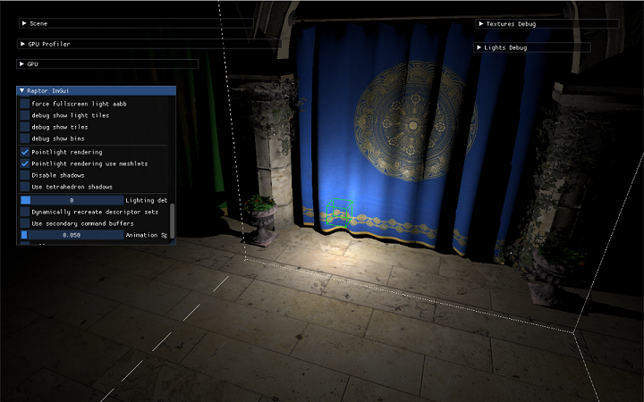

# VulkanRenderer

[![License][license-img]][license-url]
[![GitHub last commit (branch)][last-commit-img]][last-commit-url]
[![example workflow][ci-img]][ci-url]
[![GitHub Repo stars][star-img]][star-url]

[license-img]: https://img.shields.io/:license-mit-blue.svg?style=flat-square&logo=opensourceinitiative
[license-url]: https://opensource.org/licenses/MIT
[last-commit-img]: https://img.shields.io/github/last-commit/CU-Production/VulkanRenderer/main?style=flat-square&logo=git
[last-commit-url]: https://github.com/CU-Production/VulkanRenderer
[ci-img]: https://img.shields.io/github/actions/workflow/status/CU-Production/VulkanRenderer/build-cpp.yml?style=flat-square&logo=github
[ci-url]: https://github.com/CU-Production/VulkanRenderer/actions
[star-img]: https://img.shields.io/github/stars/CU-Production/VulkanRenderer?logo=github&style=flat-square
[star-url]: .

# Features

## 20230610

- [x] variable rate shading (vrs)

## 20230609

- [x] cubemap shadow map for point light
- [x] use multiview rendering to speed up render to cubemap
- [x] use sparse texture to save shadow map memory

## 20230607

- [x] clustered deferred rendering

## 20230606

- [x] GPU culling using compute shader (per primitive)
  - indirectMeshDispatch
- [x] meshlet culling using task shader (per meshlet inside a primitive)

## 20230603

- [x] compute queue for async compute
- [x] frame graph supports async compute
- [x] timeline semaphore to simplify fence/semaphore multi queue sync
- [x] cloth sim for async compute test

## 20230602

- [x] json based frame graph
- [x] use [dynamic rendering](https://www.khronos.org/blog/streamlining-render-passes) to avoid using VkRenderPass
- [x] impl deferred rendering using frame graph

## 20230528
- [x] task manager based on [enkiTS](https://github.com/dougbinks/enkiTS)
- [x] async loading texture using pinned task
- [x] transfer queue(or copy queue) for upload texture to GPU
- [x] recording commandbuffer on multiple threads using second commandbuffer

## 20230525
- [x] bindless texture
- [x] pipeline cache

# Links

- https://github.com/PacktPublishing/Mastering-Graphics-Programming-with-Vulkan
- https://github.com/KhronosGroup/glTF-Sample-Models
